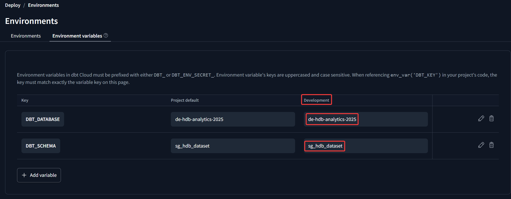

# Data Engineering Zoomcamp HDB Analytics Project

# Objective
The objective of the project is to provide resale flat buyers information on the prices of flats by flat types and by regions and towns to allow buyers to have a feel of how much a certain flat will cost in a specific region/town.


# Reproduce Project
The steps below are used to reproduce the project on a remote VM in google cloud running Ubuntu 24.04.2 LTS.

## 1. Environment Setup
### 1. Create and Access Ubuntu VM
1. In google cloud side bar, select Compute Engine -> VM Instances to navigate to the VM page.
2. Click "Create instance" button on near the top of the page and follow the instructions to create an Ubuntu VM.
3. Follow the following docs to create and add SSH keys for login to your VM:
    1. https://cloud.google.com/compute/docs/connect/create-ssh-keys
    2. https://cloud.google.com/compute/docs/connect/add-ssh-keys

### 2. Install Docker in VM
1. Follow the instructions here: https://docs.docker.com/engine/install/ubuntu/ to install the latest version of docker engine for your VM.
2. Run below commands to create docker group (if not exists) and add your user to the docker group

    ```bash
    sudo groupadd docker
    sudo gpasswd -a $USER docker
    ```
3. Logout and logback into your VM and run `docker run hello-world` to test docker cmd can be ran with your user.
4. `Docker version 28.0.4, build b8034c0` was used to reproduce the project.

### 3. Install Terraform in VM
1. Run `mkdir ~/bin` to create a binary folder for terraform and other binaries.
2. Install terraform from https://developer.hashicorp.com/terraform/install. For ubuntu installation download the binary into `~/bin` by running `wget https://releases.hashicorp.com/terraform/1.11.3/terraform_1.11.3_linux_amd64.zip` from `~/bin`.
3. Run `echo 'export PATH="$HOME/bin:$PATH"' >> ~/.bashrc` to add the bin directory to PATH.
4. Run `source ~/.bashrc` to apply the changes to the shell.
4. Run `sudo apt install unzip` to install the unzip command to unzip the downloaded terraform_1.11.3_linux_amd64.zip binary.
5. Run `unzip terraform_1.11.3_linux_amd64.zip` to unzip terraform binary to `~/bin`
6. Run `terraform -version` to check terraform is callable from the shell.


## 2. Run the Project
### 1. Clone the project to home directory
1. In your home directory run `git clone https://github.com/zashee/de-zoomcamp-hdb-analytics.git` to clone the repo to the VM.
2. Run `mkdir -p ~/de-zoomcamp-hdb-analytics/.secrets/gcp/` to create a directory to store project secrets.

### 2. Setup GCP account
1. In Google Cloud Navigation menu go to IAM & Admin -> Service Accounts page. Click "+ CREATE SERVICE ACCOUNT" button to setup your service account for terraform and airflow.
2. Add roles to your service account:
    * Storage Admin (for managing cloud storage bucket)
    * BigQuery Admin (for managing BigQuery datasets and tables)
3. Enable IAM APIs
    * https://console.cloud.google.com/apis/library/iam.googleapis.com
    * https://console.cloud.google.com/apis/library/iamcredentials.googleapis.com
4. In Service Accounts page, find your service account and click Actions menu -> KEYS tab -> click "ADD KEY" button to create your service account JSON key.
5. Save the JSON key with filename `gcp-credentials.json` to `~/de-zoomcamp-hdb-analytics/.secrets/gcp/`.

### 3. Run Terraform Provisioning
2. Edit variables.tf to point to your desired locations.
3. Run `export GOOGLE_APPLICATION_CREDENTIALS=<absolute path to credentials>` for terraform to authenticate with the env variable.
4. Run `echo $GOOGLE_APPLICATION_CREDENTIALS` to check the env variable has been instantiated.
4. cd to `~/de-zoomcamp-hdb-analytics/infrastructure/terraform` and run the following commands:
    ```bash
    # init terraform
    terraform init

    # See terraform plan 
    terraform plan

    # Apply terraform changes
    terraform apply
    ```

### 3. Run Airflow Dags
1. Run below commands from `de-zoomcamp-project/infrastructure/airflow/` directory to create logs folders and give permissions to airflow user (UID 50000) to write to logs directory.
```bash
mkdir logs
sudo chown -R 50000:0 logs
```
2. Build the docker images defined in docker-compose.yaml with `docker compose build`.
3. Run the containers with `docker compose up -d`.
4. Use vscode to port foward port 8080 and access airflow from your browser with localhost:8080.
5. Login with username: `airflow` and password: `airflow`.
6. Create gcp connection for airflow:
    1. In the top menu, click on Admin tab -> select Connections in the dropdown menu.
    2. On the Connections page click the "+" button to add a new record.
    3. Fill in the following details
        * Connection Id: `gcp-airflow`
        * Connection Type: `Google Cloud`
        * ProjectId: `<your google cloud project id>`
        * Keyfile Path: `/opt/airflow/gcp/gcp-credentials.json`
    4. Click save at the bottom of the page.
7. Go DAGs tab -> click on hdb_resale_data_2017_onwards dag -> unpause the dag to run the dag.

### 4. Dbt Cloud
1. Upon login to Dbt Cloud at the bottom left corner with your username, click the arrow -> your profile.
2. Under User profile page -> "Linked accounts" section, connect dbt cloud to github and allow the project repository to be linked to dbt cloud.
3. Push this project's repo to your github to access it from dbt cloud.
3. Create project and setup connection to bigquery (https://docs.getdbt.com/guides/bigquery). The project subdirectory should be `de-zoomcamp-hdb-analytics/dbt`.
4. Click Develop tab and setup the IDE with `de-zoomcamp-hdb-analytics/dbt` subfolder containing the dbt project.
5. Under Deploy tab -> Environments -> click Environment variables and add `DBT_DATABASE` and `DBT_SCHEMA` env variables to force DBT to write data to the targeted bigquery database and dataset in development instead of the default `dbt<username>` development enviroment. Refer to below screenshot for an example.

6. run `dbt seed` command to create seed tables.
7. run `dbt build --full-refresh` to create all tables.

### 5. Power BI Dashboard Usage
Power BI dashboard can be found here: [HDB Analytics Dashboard](https://app.powerbi.com/view?r=eyJrIjoiMTc3ZGNiZDQtZjlhMS00NDUwLThhZTMtNjJjMWFhYTY2ZjAzIiwidCI6ImIzNGVmZTExLTE0ZjAtNGEzNi05MjI4LThjMDExNWEwMGRkNyIsImMiOjEwfQ%3D%3D&pageName=abe9f6a7074b8079c206)
* Filter charts by using the year slicer.
* Hover over any of the clustered bars in "Average Resale Price By Flat Type" chart to see a pop up tooltip showing average resale price by remaining lease.
* Click on any of the flat type in "Average Resale Price By Flat Type" chart to filter by flat type.
* Hover over "Average Resale Price by Location" chart and click on the big down arrow icon at the top right of the chart to enable drill down. Then click on any of the region to drill down to town data.
